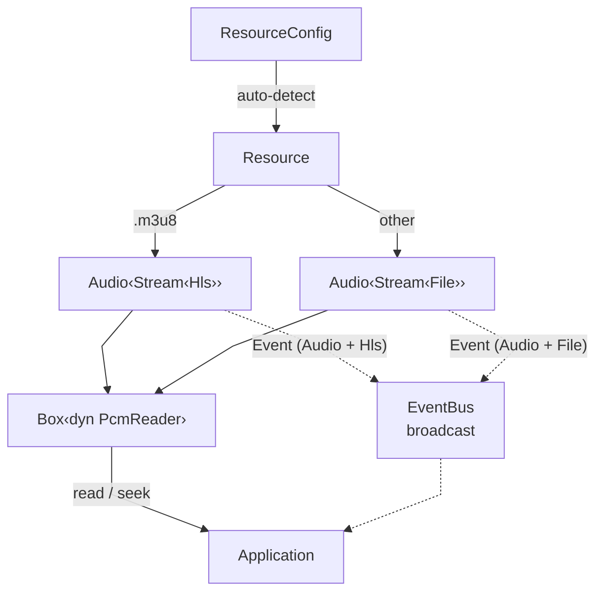

<div align="center">
  
</div>

<div align="center">

[](../../LICENSE-MIT)

</div>

# kithara

Facade crate for the kithara audio engine. Auto-detects source type from URL (`.m3u8` = HLS, everything else = progressive file) and exposes a type-erased `Resource` with a simple `read()`/`seek()` interface. Re-exports all sub-crates as modules for convenient access to the full stack.

## Usage

```rust
use kithara::prelude::*;

// Auto-detect from URL
let config = ResourceConfig::new("https://example.com/song.mp3")?;
let mut resource = Resource::new(config).await?;

let spec = resource.spec();
let mut buf = [0.0f32; 1024];
while !resource.is_eof() {
    let n = resource.read(&mut buf);
    play(&buf[..n]);
}
```

## Architecture


```mermaid
%%{init: {"flowchart": {"curve": "linear"}} }%%
flowchart TD
    RC[ResourceConfig] -->|auto-detect| R[Resource]
    R -->|".m3u8"| AH["Audio‹Stream‹Hls››"]
    R -->|other| AF["Audio‹Stream‹File››"]

    AH --> PR["Box‹dyn PcmReader›"]
    AF --> PR

    PR -->|"read / seek"| APP[Application]

    AH -. "Event (Audio + Hls)" .-> EV[EventBus<br/>broadcast]
    AF -. "Event (Audio + File)" .-> EV
    EV -.-> APP
```

`Resource` wraps `Box<dyn PcmReader>` with a shared `EventBus` for all events (audio, stream, HLS).

## Features

<table>
<tr><th>Feature</th><th>Default</th><th>Enables</th></tr>
<tr><td><code>file</code></td><td>yes</td><td>Progressive pipeline (<code>kithara-file</code>, <code>kithara-assets</code>, <code>kithara-net</code>)</td></tr>
<tr><td><code>hls</code></td><td>yes</td><td>HLS pipeline (<code>kithara-hls</code>, <code>kithara-abr</code>, <code>kithara-assets</code>, <code>kithara-net</code>, <code>kithara-drm</code>)</td></tr>
<tr><td><code>symphonia</code></td><td>yes</td><td>Symphonia software decoder backend (<code>kithara-audio/symphonia</code>, <code>kithara-decode/symphonia</code>)</td></tr>
<tr><td><code>apple</code></td><td>no</td><td>Apple AudioToolbox hardware decoder (<code>kithara-audio/apple</code>, <code>kithara-play/apple</code>)</td></tr>
<tr><td><code>android</code></td><td>no</td><td>Android <code>MediaExtractor</code>/<code>MediaCodec</code> hardware decoder (<code>kithara-audio/android</code>, <code>kithara-decode/android</code>)</td></tr>
<tr><td><code>assets</code></td><td>no</td><td>Asset/storage modules (<code>kithara-assets</code>, <code>kithara-storage</code>)</td></tr>
<tr><td><code>net</code></td><td>no</td><td>Network module (<code>kithara-net</code>)</td></tr>
<tr><td><code>bufpool</code></td><td>no</td><td>Aggregator flag used by <code>full</code>; the <code>kithara::bufpool</code> module is always re-exported</td></tr>
<tr><td><code>full</code></td><td>no</td><td>Shortcut for <code>file + hls + assets + net + bufpool</code></td></tr>
<tr><td><code>probe</code></td><td>no</td><td>USDT probes across <code>kithara-audio</code>, <code>kithara-decode</code>, <code>kithara-stream</code>, <code>kithara-play</code></td></tr>
<tr><td><code>mock</code></td><td>no</td><td><code>unimock</code>-generated mocks across the same sub-crates</td></tr>
<tr><td><code>perf</code></td><td>no</td><td>Hotpath instrumentation across sub-crates</td></tr>
</table>

## Key Types

<table>
<tr><th>Type</th><th>Role</th></tr>
<tr><td><code>Resource</code></td><td>Type-erased wrapper over <code>Box&lt;dyn PcmReader&gt;</code> — single entry point for PCM reading (defined in <code>kithara-play</code>)</td></tr>
<tr><td><code>ResourceConfig</code></td><td>Builder holding source, network, ABR, and cache options</td></tr>
<tr><td><code>ResourceSrc</code></td><td>Source enum: <code>Url(Url)</code> or <code>Path(PathBuf)</code></td></tr>
<tr><td><code>SourceType</code></td><td>Auto-detection result: <code>RemoteFile(Url)</code>, <code>LocalFile(PathBuf)</code>, or <code>HlsStream(Url)</code></td></tr>
<tr><td><code>Event</code></td><td>Unified event enum re-exported from <code>kithara-events</code></td></tr>
<tr><td><code>EventBus</code></td><td>Clonable broadcast publisher — subscribe for a unified <code>Event</code> stream</td></tr>
</table>

## Re-exports

The crate re-exports each engine sub-crate as a public module — `kithara::audio`, `kithara::bufpool`, `kithara::decode`, `kithara::events`, `kithara::platform`, `kithara::play`, `kithara::stream`. The `file`/`hls`/`assets`/`net`/`storage` modules are feature-gated and only appear when the corresponding feature is enabled. A `prelude` module aggregates the most commonly used types from those re-exports.

## Integration

Most consumers depend on `kithara` with the default features and call `Resource::new(ResourceConfig::new(url)?).await?` rather than wiring sub-crates manually. For embedded or wasm builds, disable the defaults and pick the minimal feature set.
