# Kithara: Codebase Analysis

> This document is produced by analyzing the source code exclusively, without relying on
> README files or other documentation. It describes each crate and the project as a whole.

## Table of Contents

- [Project Overview](#project-overview)
- [Architecture](#architecture)
- [Crate Dependency Graph](#crate-dependency-graph)
- [Diagrams](#diagrams)
  - [Crate Dependencies (Mermaid)](#crate-dependencies-mermaid)
  - [Progressive File Dataflow](#progressive-file-dataflow)
  - [HLS Dataflow](#hls-dataflow)
  - [Thread and Task Model](#thread-and-task-model)
  - [Async-to-Sync Bridge (Storage)](#async-to-sync-bridge-storage)
  - [Assets Decorator Chain](#assets-decorator-chain)
  - [Net Decorator Chain](#net-decorator-chain)
  - [ABR Decision Flow](#abr-decision-flow)
  - [Event Propagation](#event-propagation)
  - [Buffer Pool Lifecycle](#buffer-pool-lifecycle)
  - [HLS Segment Stitching](#hls-segment-stitching)
  - [File Three-Phase Download](#file-three-phase-download)
  - [Seek Sequence (File)](#seek-sequence-file)
  - [HLS ABR Variant Switch](#hls-abr-variant-switch)
- [kithara (facade)](#kithara-facade)
- [kithara-bufpool](#kithara-bufpool)
- [kithara-storage](#kithara-storage)
- [kithara-assets](#kithara-assets)
- [kithara-net](#kithara-net)
- [kithara-stream](#kithara-stream)
- [kithara-file](#kithara-file)
- [kithara-hls](#kithara-hls)
- [kithara-abr](#kithara-abr)
- [kithara-drm](#kithara-drm)
- [kithara-decode](#kithara-decode)
- [kithara-audio](#kithara-audio)
- [Integration Tests](#integration-tests)
- [Cross-Cutting Patterns](#cross-cutting-patterns)

---

## Project Overview

Kithara is a Rust workspace providing networking and decoding building blocks for audio
playback. It is **not** a full audio player; it is a library that handles everything from
fetching audio data (progressive HTTP download or HLS) through decoding to producing PCM
samples ready for playback.

Key capabilities:

- Progressive HTTP file streaming (MP3, AAC, FLAC, WAV, OGG, etc.)
- HLS VOD streaming with adaptive bitrate (ABR)
- AES-128-CBC segment decryption
- Multi-backend audio decoding (Symphonia software, Apple AudioToolbox hardware, Android
  MediaCodec placeholder)
- Sample rate conversion and resampling
- Disk and in-memory caching with LRU eviction
- Zero-allocation hot paths via sharded buffer pools
- Crash-safe partial download tracking

The workspace targets `edition = "2024"` and is dual-licensed under MIT / Apache-2.0.

---

## Architecture

The system is layered bottom-up: low-level storage primitives at the base, protocol
orchestration in the middle, and decoding/audio pipeline at the top. A single facade crate
(`kithara`) unifies everything behind a type-erased `Resource` that can play any supported
source.

---

## Crate Dependency Graph

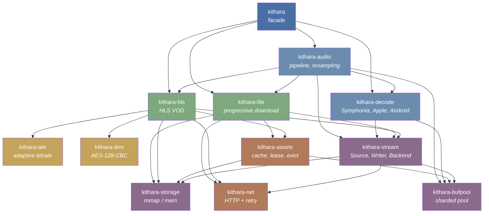

---

## Diagrams

### Crate Dependencies (Mermaid)

See [Crate Dependency Graph](#crate-dependency-graph) above.

---

### Progressive File Dataflow

End-to-end data flow for `Stream<File>` (progressive HTTP download to PCM output):

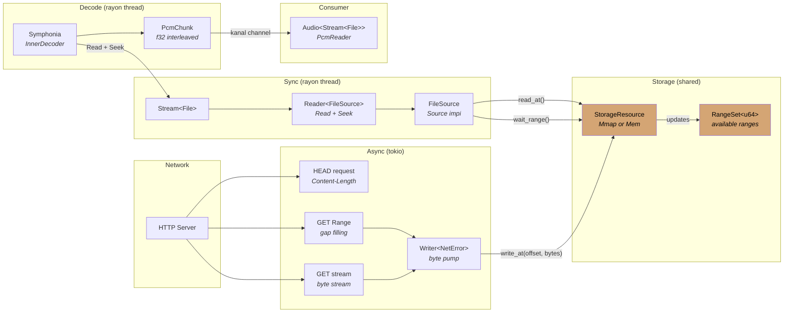

---

### HLS Dataflow

End-to-end data flow for `Stream<Hls>` (HLS VOD with ABR):

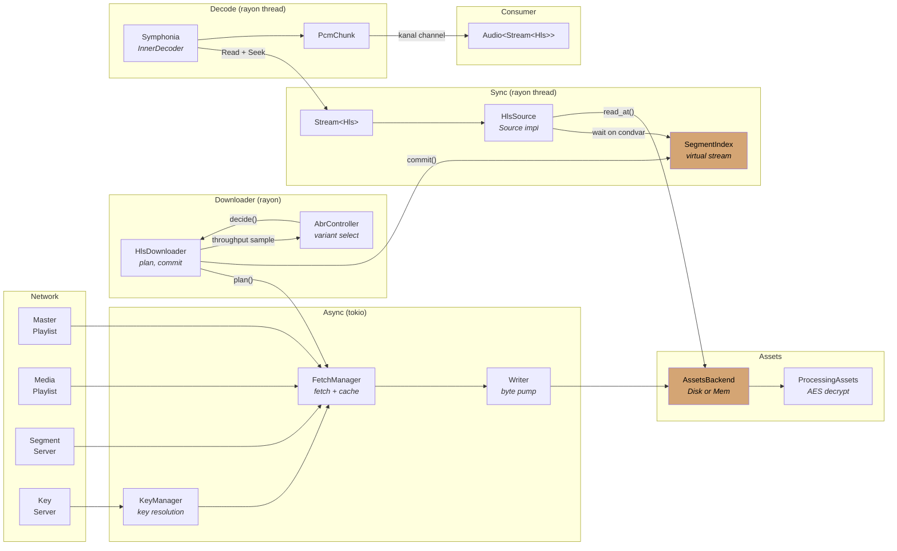

---

### Thread and Task Model

Overview of threads, async tasks, and their communication channels:

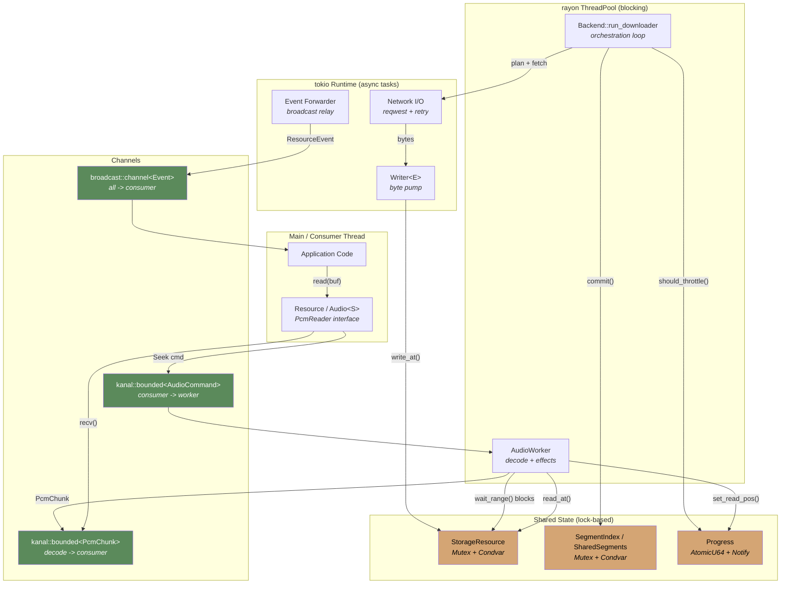

---

### Async-to-Sync Bridge (Storage)

Detailed view of the central synchronization mechanism:

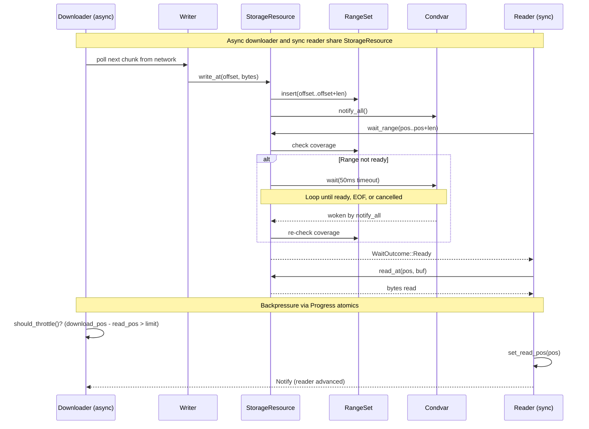

---

### Assets Decorator Chain

Request flow through the `AssetStore` decorator stack:

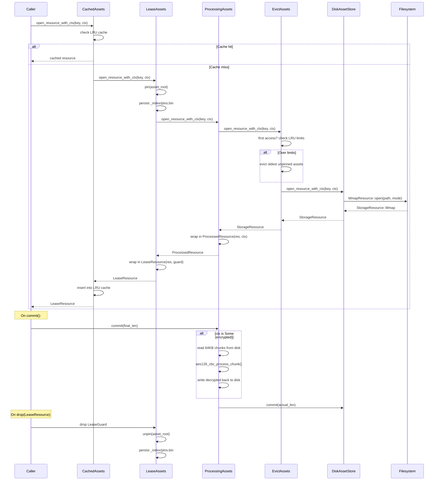

---

### Net Decorator Chain

HTTP request flow through composed decorators:

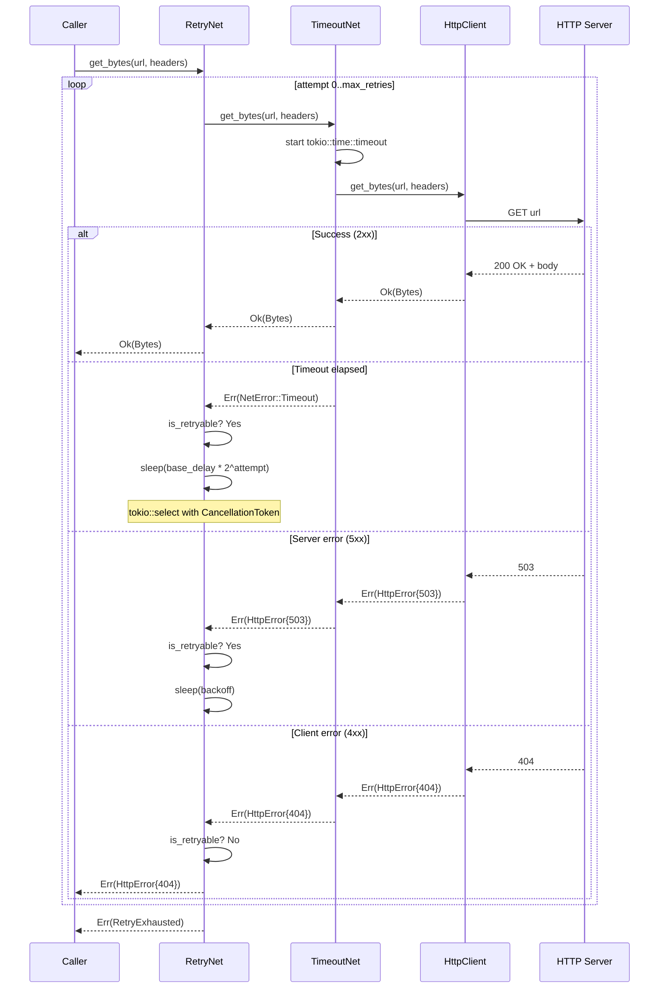

---

### ABR Decision Flow

Adaptive bitrate decision-making process:

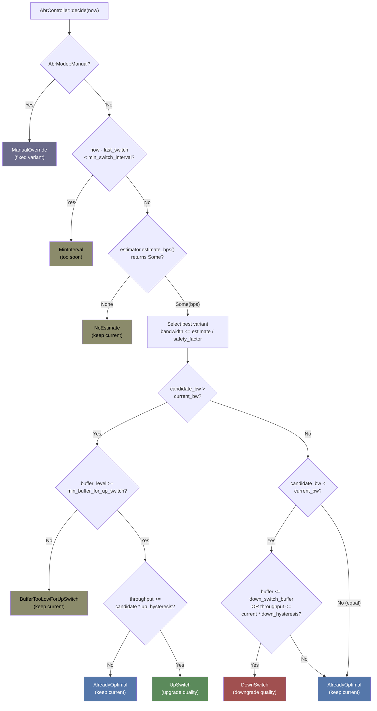

---

### Event Propagation

How events flow from protocol crates to the consumer:

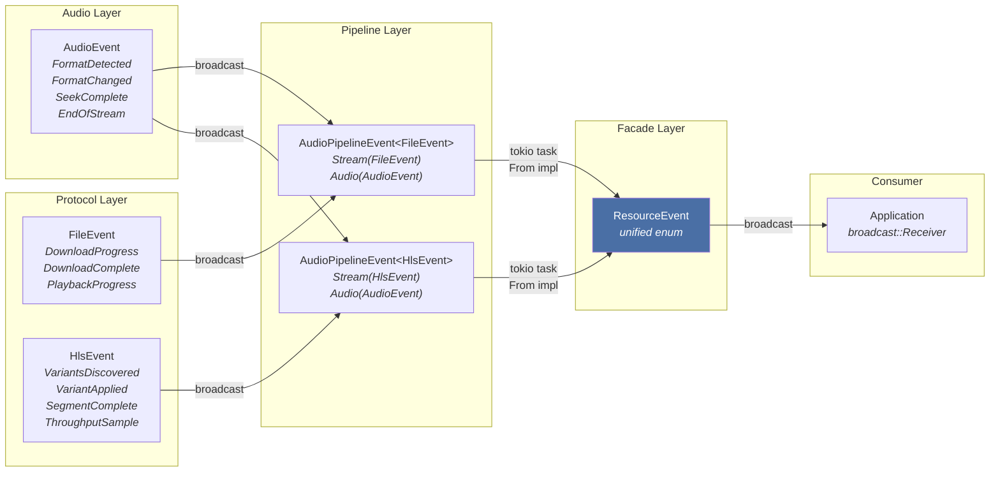

---

### Buffer Pool Lifecycle

Allocation and recycling flow in `kithara-bufpool`:

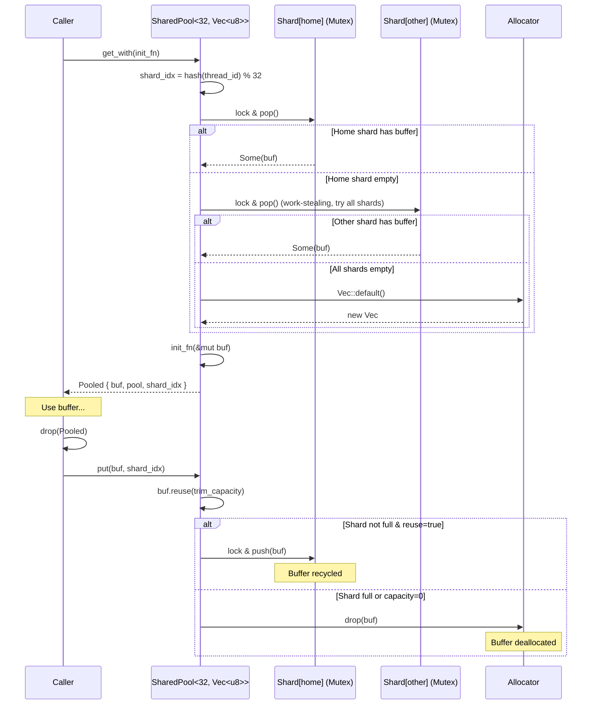

---

### HLS Segment Stitching

Virtual stream layout and mid-stream ABR variant switch:

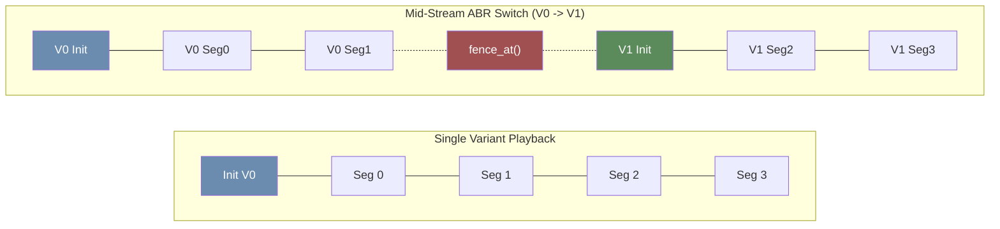

---

### File Three-Phase Download

State machine for progressive file download phases:

```mermaid
stateDiagram-v2
    [*] --> Sequential: File::create()

    Sequential --> GapFilling: Stream ends early\nor network error
    Sequential --> Complete: All bytes received\ncommit(total_len)

    GapFilling --> GapFilling: Range request\ncompletes a gap
    GapFilling --> Complete: All gaps filled\ncoverage.is_complete()

    Complete --> [*]

    state Sequential {
        [*] --> Streaming
        Streaming: Writer pumps bytes\nfrom HTTP stream to StorageResource
        Streaming --> Throttled: download_pos - read_pos > look_ahead_bytes
        Throttled --> Streaming: Reader advances\nProgress::reader_advanced
        Streaming --> StreamEnded: HTTP stream EOF
    }

    state GapFilling {
        [*] --> FindGaps
        FindGaps: coverage.next_gap(2MB)
        FindGaps --> BatchFetch: Up to 4 gaps
        BatchFetch: Parallel HTTP Range requests
        BatchFetch --> CommitGap: Range downloaded
        CommitGap: Mark coverage,\nflush to disk
        CommitGap --> FindGaps: More gaps?
    }
```

---

### Seek Sequence (File)

What happens when the consumer seeks during progressive download:

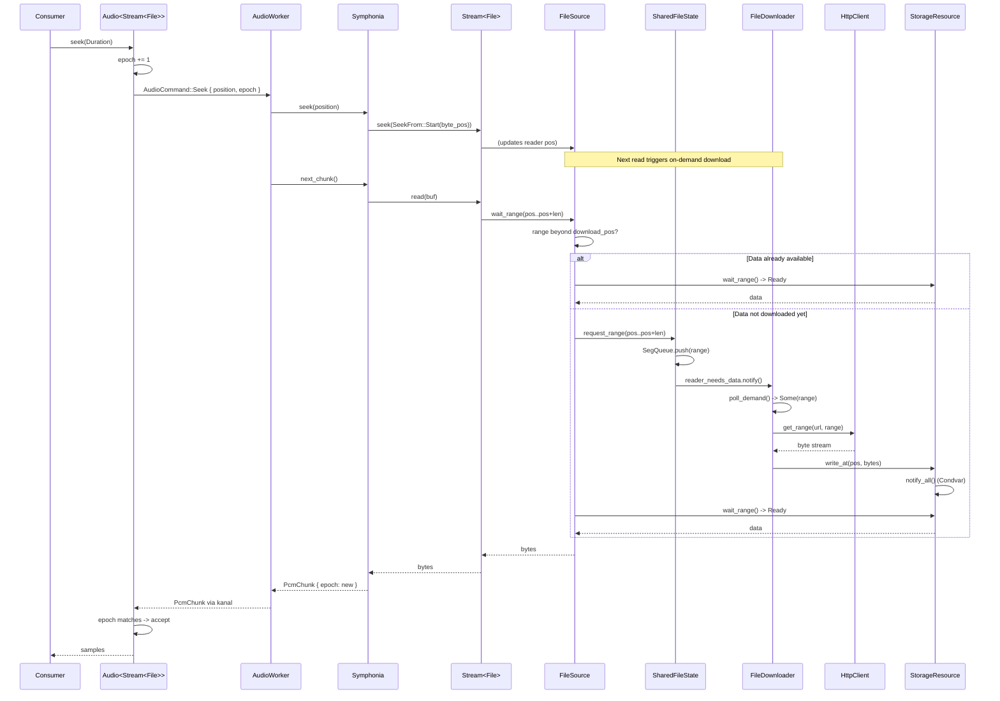

---

### HLS ABR Variant Switch

Sequence when ABR decides to switch quality mid-stream:

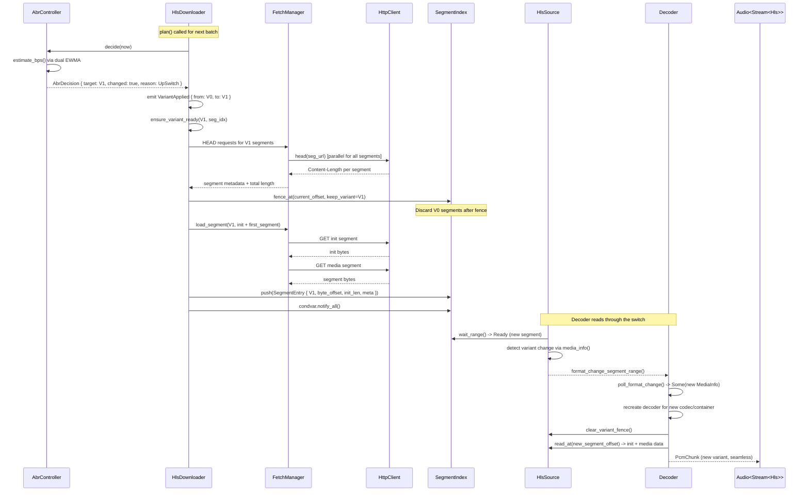

---

## kithara (facade)

**Path:** `crates/kithara`

The top-level crate that provides a unified, type-erased API for audio playback from any
supported source. Consumers interact primarily with `Resource`.

### Key Types

| Type | Role |
|------|------|
| `Resource` | Type-erased wrapper over `Box<dyn PcmReader>`. Single entry point for reading PCM. |
| `ResourceConfig` | Builder for creating a `Resource`. Holds URL/path, network options, ABR options, cache options, etc. |
| `ResourceSrc` | Enum: `Url(Url)` or `Path(PathBuf)`. |
| `SourceType` | Auto-detection enum: `RemoteFile`, `LocalFile`, `HlsStream`. Determined by URL extension (`.m3u8` -> HLS). |
| `ResourceEvent` | Unified event enum aggregating all upstream events (audio, file, HLS, ABR). |

### How It Works

1. `ResourceConfig::new(input)` parses a URL or absolute path into `ResourceSrc`.
2. `Resource::new(config)` calls `SourceType::detect()` to classify the source.
3. Based on source type, constructs either `Audio<Stream<File>>` or `Audio<Stream<Hls>>`.
4. The resulting audio pipeline is type-erased into `Box<dyn PcmReader>`.
5. A background tokio task forwards typed events into a unified `ResourceEvent` broadcast.
6. Consumer reads PCM via `resource.read(&mut buf)` or `resource.read_planar(...)`.

### Feature Flags

| Feature | Effect |
|---------|--------|
| `file` (default) | Enables progressive file download |
| `hls` (default) | Enables HLS streaming + ABR |
| `rodio` | Implements `rodio::Source` on `Resource` |
| `perf` | Propagates performance instrumentation to all crates |
| `full` | Enables all features |

### Re-exports

The crate re-exports all sub-crates as public modules (`kithara::audio`, `kithara::decode`,
`kithara::stream`, `kithara::file`, `kithara::hls`, `kithara::abr`, `kithara::net`, etc.)
and provides a `prelude` module with the most commonly used types.

---

## kithara-bufpool

**Path:** `crates/kithara-bufpool`

Generic, thread-safe, sharded buffer pool for zero-allocation hot paths.

### Core Design

The pool is parameterized at compile time by the number of shards (`SHARDS`) and the buffer
type (`T: Reuse`). Each shard is a `parking_lot::Mutex<Vec<T>>`. Thread affinity is achieved
by hashing the current thread ID to select a "home" shard. When the home shard is empty, the
pool work-steals from other shards before falling back to `T::default()`.

### Key Types

| Type | Description |
|------|-------------|
| `Reuse` (trait) | Defines how a buffer resets itself. `Vec<T>` has a built-in implementation that clears and optionally shrinks. |
| `Pool<SHARDS, T>` | The core sharded pool. |
| `Pooled<'a, SHARDS, T>` | RAII borrowed wrapper. Automatically returns the buffer to the pool on drop. Implements `Deref`/`DerefMut`. |
| `PooledOwned<SHARDS, T>` | RAII owned wrapper (holds `Arc<Pool>`). `'static`, suitable for async contexts. |
| `SharedPool<SHARDS, T>` | Convenience wrapper around `Arc<Pool>` with `get()`, `recycle()`, `attach()`. |
| `PooledSlice` / `PooledSliceOwned` | Wrappers with tracked length for partial-fill scenarios (e.g., network reads). |

### Global Pools

Two pre-configured global pools are exposed via `global.rs`:

```rust
pub type BytePool = SharedPool<32, Vec<u8>>;   // 1024 max buffers, 64 KB trim
pub type PcmPool  = SharedPool<32, Vec<f32>>;  // 64 max buffers, 200K trim

pub fn byte_pool() -> &'static BytePool;
pub fn pcm_pool()  -> &'static PcmPool;
```

A `global_pool!` macro allows defining additional global pools.

### Allocation Flow

1. **Get:** Lock home shard -> pop. If empty, try other shards (work-stealing). If all empty,
   allocate via `T::default()`. Apply initialization closure.
2. **Return (drop):** Call `value.reuse(trim_capacity)` to clear and shrink. If shard is not
   full and reuse returns `true`, push back. Otherwise, drop silently.

### Feature Flags

- `perf`: Enables `hotpath::measure` on the `get_with` method for profiling.

---

## kithara-storage

**Path:** `crates/kithara-storage`

Unified, backend-agnostic storage layer with two drivers: mmap (filesystem) and in-memory.
Designed for streaming I/O with incremental writes, range tracking, and atomic operations.

### Key Types

| Type | Description |
|------|-------------|
| `ResourceExt` (trait) | Consumer-facing API: `read_at`, `write_at`, `wait_range`, `commit`, `fail`, `reactivate`, `read_into`, `write_all`. |
| `Driver` (trait) | Backend abstraction with associated `Options` type. |
| `StorageResource` | Enum dispatching to `MmapResource` or `MemResource`. |
| `OpenMode` | `Auto` (default), `ReadWrite`, `ReadOnly`. |
| `ResourceStatus` | `Active`, `Committed { final_len }`, `Failed(String)`. |
| `WaitOutcome` | `Ready` or `Eof`. |
| `Atomic<R>` | Decorator for crash-safe writes via write-temp-rename. |
| `Coverage` (trait) | Tracks downloaded byte ranges. `MemCoverage` is the in-memory impl. |

### Mmap vs. Mem Drivers

| Aspect | MmapDriver | MemDriver |
|--------|-----------|-----------|
| Backing | `mmap-io::MemoryMappedFile` | `Vec<u8>` behind `Mutex` |
| Lock-free fast path | Yes (`SegQueue` for write notifications) | No |
| Auto-resize | 2x growth on overflow | Extend on write |
| Post-commit writes | Only in `ReadWrite` mode | Never |
| `path()` | `Some` | `None` |

### Range Tracking

Internally uses `RangeSet<u64>` (from `rangemap`) to track which byte ranges have been
written. `wait_range` blocks (via `Condvar` with 50 ms timeout) until the requested range is
fully covered, or returns `Eof` when the resource is committed and the range starts beyond
the final length.

### Synchronization

- `parking_lot::Mutex<CommonState>` + `Condvar` for state and coordination.
- `crossbeam_queue::SegQueue<Range<u64>>` for lock-free fast-path on mmap writes.
- `CancellationToken` checked at operation entry and during wait loops.

---

## kithara-assets

**Path:** `crates/kithara-assets`

Disk and in-memory asset store with decorator-based feature composition: caching, leasing
(pinning), processing (decryption), and LRU eviction.

### Decorator Chain

The full stack (outermost to innermost):

```
CachedAssets<LeaseAssets<ProcessingAssets<EvictAssets<DiskAssetStore>>>>
```

Each layer wraps the previous and implements the `Assets` trait. Layers can be
independently enabled/disabled via builder.

| Layer | Responsibility |
|-------|---------------|
| `CachedAssets` | In-memory LRU cache (default 5 entries). Prevents duplicate mmap opens. |
| `LeaseAssets` | RAII-based pinning. Every `open_resource()` pins the asset root; `LeaseGuard` unpins on drop. Prevents eviction of in-use assets. |
| `ProcessingAssets` | Optional chunk-based transformation (e.g., AES-128-CBC decryption) on `commit()`. Uses 64 KB chunks from buffer pool. |
| `EvictAssets` | LRU eviction by asset count and/or byte size. Pinned assets excluded. Soft caps (best-effort). |
| `DiskAssetStore` | Base disk I/O. Maps `ResourceKey` to filesystem paths under `<root_dir>/<asset_root>/`. |
| `MemAssetStore` | In-memory variant using `DashMap<ResourceKey, MemResource>`. |

### Key Types

| Type | Description |
|------|-------------|
| `Assets` (trait) | Base abstraction with associated `Res`, `Context`, `IndexRes` types. |
| `ResourceKey` | `Relative(String)` or `Absolute(PathBuf)`. |
| `AssetStore<Ctx>` | Full disk decorator stack (type alias). |
| `MemStore<Ctx>` | Full in-memory decorator stack (type alias). |
| `AssetsBackend<Ctx>` | Enum: `Disk(AssetStore)` or `Mem(MemStore)`. |
| `AssetStoreBuilder<Ctx>` | Fluent builder for constructing the full stack. |
| `AssetResource<Ctx>` | `LeaseResource<ProcessedResource<StorageResource, Ctx>, LeaseGuard>`. |

### Index Persistence

Three index types are persisted under `_index/` for crash recovery:

| Index | File | Purpose |
|-------|------|---------|
| `PinsIndex` | `_index/pins.bin` | Persists pinned asset roots. |
| `LruIndex` + `LruState` | `_index/lru.bin` | Monotonic clock + byte accounting for eviction decisions. |
| `CoverageIndex` + `DiskCoverage` | `_index/cov.bin` | Per-segment byte-range coverage for partial download tracking. |

All indices use bincode + `Atomic<R>` for crash-safe writes.

### Asset Root Generation

Asset roots are derived from URLs via `SHA256(canonical_url + optional_name)`, producing a
32-character hex string. URL canonicalization removes query/fragment, normalizes scheme/host,
and strips default ports.

---

## kithara-net

**Path:** `crates/kithara-net`

Async HTTP networking built on `reqwest` with trait-based abstractions and composable
decorators.

### Core Trait

```rust
#[async_trait]
pub trait Net: Send + Sync {
    async fn get_bytes(&self, url: Url, headers: Option<Headers>) -> Result<Bytes, NetError>;
    async fn stream(&self, url: Url, headers: Option<Headers>) -> Result<ByteStream, NetError>;
    async fn get_range(&self, url: Url, range: RangeSpec, headers: Option<Headers>)
        -> Result<ByteStream, NetError>;
    async fn head(&self, url: Url, headers: Option<Headers>) -> Result<Headers, NetError>;
}
```

### Decorators

| Decorator | Behavior |
|-----------|----------|
| `TimeoutNet<N>` | Wraps all methods with `tokio::time::timeout`. |
| `RetryNet<N, P>` | Exponential backoff retry. Classifies errors as retryable (5xx, 429, 408, timeouts) or not (4xx except 408/429). Respects `CancellationToken`. |

Decorators compose via `NetExt` extension trait:
```rust
HttpClient::new(opts).with_retry(policy, cancel).with_timeout(duration)
```

### Key Types

| Type | Description |
|------|-------------|
| `HttpClient` | `reqwest::Client` wrapper implementing `Net`. |
| `Headers` | `HashMap<String, String>` wrapper. |
| `RangeSpec` | HTTP byte range: `{ start: u64, end: Option<u64> }`. |
| `RetryPolicy` | `{ base_delay, max_delay, max_retries }`. Default: 3 retries, 100 ms base, 5 s max. |
| `NetOptions` | `{ pool_max_idle_per_host, request_timeout, retry_policy }`. |
| `NetError` | `Http`, `InvalidRange`, `Timeout`, `RetryExhausted`, `HttpError { status, url, body }`, `Cancelled`. |

### Timeout Behavior

- `get_bytes()`, `head()`: apply `request_timeout` from options.
- `stream()`: **no timeout** (designed for long downloads).
- Decorator layer can override with custom timeout.

---

## kithara-stream

**Path:** `crates/kithara-stream`

Core byte-stream orchestration that bridges async downloading with sync `Read + Seek`.
This is the central abstraction enabling progressive playback.

### Key Traits

| Trait | Purpose |
|-------|---------|
| `Source` | Sync random-access interface: `wait_range`, `read_at`, `len`, `media_info`, segment tracking. |
| `Downloader` | Async planner: `plan()` returns batches or step mode; `commit()` stores results; `should_throttle()` / `wait_ready()` for backpressure. |
| `DownloaderIo` | Pure I/O (network fetch), `Clone + Send`, stateless. Runs multiple copies in parallel. |
| `StreamType` | Marker trait for protocol types (`File`, `Hls`). Associated types: `Config`, `Source`, `Error`, `Event`. |

### Key Structs

| Struct | Description |
|--------|-------------|
| `Reader<S: Source>` | Sync `Read + Seek` wrapper. Calls `source.wait_range()` then `source.read_at()`. |
| `Writer<E>` | Async byte pump. Implements `futures::Stream`, writes chunks to `StorageResource` via `write_at`. |
| `Backend` | Spawns downloader task on thread pool. Orchestration loop: drain demand -> plan -> fetch in parallel -> commit. |
| `Stream<T: StreamType>` | Generic stream wrapping `Reader<T::Source>`. Implements `Read + Seek`. Supports format change signaling for ABR. |
| `ThreadPool` | Wrapper around `rayon::ThreadPool` for blocking work. |

### Canonical Types

Defined here as the single source of truth:

```rust
pub enum AudioCodec { AacLc, AacHe, AacHeV2, Mp3, Flac, Vorbis, Opus, Alac, Pcm, Adpcm }
pub enum ContainerFormat { Fmp4, MpegTs, MpegAudio, Adts, Flac, Wav, Ogg, Caf, Mkv }
pub struct MediaInfo { channels, codec, container, sample_rate, variant_index }
```

### Async-to-Sync Bridge

The fundamental design pattern:

1. **Downloader** (async) writes data to `StorageResource` via `Writer`.
2. **Reader** (sync) calls `StorageResource::wait_range()`, which blocks until bytes are
   available.
3. `StorageResource` is the synchronization point -- no channels between reader and
   downloader.
4. **Backpressure**: downloader pauses via `should_throttle()` when too far ahead of the
   reader.
5. **On-demand**: reader can request specific ranges (for seeks) that bypass backpressure.

### Epoch-Based Stale Filtering

`EpochValidator` increments epoch on seek. Chunks from previous epochs are discarded,
preventing old data from reaching the decoder after a seek.

---

## kithara-file

**Path:** `crates/kithara-file`

Progressive HTTP file download. Implements `StreamType` for use as `Stream<File>`.

### Key Types

| Type | Description |
|------|-------------|
| `File` | Marker type implementing `StreamType`. |
| `FileConfig` | Source (`FileSrc::Remote(Url)` or `FileSrc::Local(PathBuf)`), network options, store options, backpressure (`look_ahead_bytes`). |
| `FileSource` | Implements `Source`. Wraps `AssetResource` with progress tracking. |
| `FileEvent` | `DownloadProgress`, `DownloadComplete`, `DownloadError`, `PlaybackProgress`, `Error`, `EndOfStream`. |

### Three-Phase Download

| Phase | Strategy |
|-------|----------|
| Sequential | Stream from file start via `Writer`. Fast path for complete downloads. |
| Gap Filling | HTTP Range requests for missing chunks. Batches up to 4 gaps, each up to 2 MB. |
| Complete | All data downloaded; no further activity. |

### Local File Handling

When `FileSrc::Local(path)`, the crate opens the file via `AssetStore` with an absolute
`ResourceKey`, skips all network activity, and creates a fully-cached `FileSource` with no
background downloader.

### On-Demand Downloads

`SharedFileState` carries range requests between the sync reader and async downloader via a
lock-free `SegQueue`. When the reader seeks beyond the current download position, it pushes a
range request that the downloader picks up with higher priority than sequential downloading.

### Coverage Tracking

`FileCoverage` wraps either `MemCoverage` (ephemeral) or `DiskCoverage` (persistent). The
disk variant persists to `_index/cov.bin` for crash-safe recovery of partial downloads.

---

## kithara-hls

**Path:** `crates/kithara-hls`

HLS VOD orchestration with ABR, caching, and optional encryption support. Implements
`StreamType` for use as `Stream<Hls>`.

### Key Types

| Type | Description |
|------|-------------|
| `Hls` | Marker type implementing `StreamType`. |
| `HlsConfig` | Master playlist URL, ABR options, key options, network/store options, batch size, backpressure. |
| `HlsSource` | Implements `Source`. Provides sync random-access reading from stitched segments. |
| `FetchManager` | Unified fetch layer: network + `AssetsBackend` for disk or in-memory cache. Parses and caches playlists. |
| `HlsDownloader` | `Downloader` implementation. Makes ABR decisions, batches segment downloads, handles variant switches. |
| `HlsEvent` | `VariantsDiscovered`, `VariantApplied`, `SegmentStart`, `SegmentProgress`, `SegmentComplete`, `ThroughputSample`, download/playback events. |

### Playlist Parsing

Located in `parsing.rs`. Uses the `hls_m3u8` crate.

- `parse_master_playlist(data)` -> `MasterPlaylist { variants: Vec<VariantStream> }`.
  Extracts bandwidth, codecs, container format from `STREAM-INF` tags.
- `parse_media_playlist(data, variant_id)` -> `MediaPlaylist { segments, init_segment, current_key, ... }`.
  Parses segments with durations, tracks encryption keys via `#EXT-X-KEY`, detects init
  segments via `#EXT-X-MAP`.

### Virtual Stream Layout

HLS segments are logically stitched into a contiguous byte stream:

```
Single variant:
  [Init] [Seg0] [Seg1] [Seg2] ...
  0──────┬──────┬──────┬──────┤

Mid-stream variant switch (ABR):
  [V0 Seg0] [V0 Seg1] (fence) [V3 Init] [V3 Seg14] [V3 Seg15] ...
  0─────────┬─────────┬────────┬─────────┬──────────┤
```

`SegmentIndex` maintains a `HashMap<(variant, segment_index), SegmentEntry>` plus a
`RangeSet<u64>` for loaded byte ranges. `fence_at()` discards old variant segments on ABR
switch.

### Shared State

`SharedSegments` coordinates the async downloader and sync source:
- `segments: Mutex<SegmentIndex>` + `condvar: Condvar`
- `eof: AtomicBool`, `reader_offset: AtomicU64`
- `segment_requests: SegQueue<SegmentRequest>` for on-demand loading

### ABR Integration

1. `plan()` calls `make_abr_decision()` which queries `AbrController`.
2. On variant change: emit `VariantApplied`, calculate new variant metadata via HEAD requests.
3. `ensure_variant_ready()` handles mid-stream switches by fencing old segments.
4. Throughput samples are fed to ABR after each segment download.

### Caching and Offline Support

- Leverages `AssetsBackend<DecryptContext>` (disk or ephemeral).
- `populate_cached_segments()` scans disk for committed segments on startup.
- `allow_cache` flag from `#EXT-X-ALLOW-CACHE` respected.
- `CoverageIndex` tracks per-segment coverage for crash recovery.

---

## kithara-abr

**Path:** `crates/kithara-abr`

Protocol-agnostic adaptive bitrate algorithm.

### Core: AbrController

```rust
pub struct AbrController<E: Estimator> { ... }
```

Operates in two modes:
- **Auto**: Adaptive quality switching based on throughput estimation and buffer level.
- **Manual**: Fixed variant, ignores network conditions.

### Decision Logic

1. If in Manual mode -> return current variant with `ManualOverride` reason.
2. If less than `min_switch_interval` (30 s) since last switch -> return current
   (`MinInterval`).
3. Estimate throughput via dual-track EWMA.
4. Select highest-bandwidth variant not exceeding `estimate / safety_factor`.
5. **Up-switch**: requires buffer >= `min_buffer_for_up_switch_secs` (10 s) AND throughput
   >= `candidate_bw * up_hysteresis_ratio` (1.3x).
6. **Down-switch**: triggered by buffer <= `down_switch_buffer_secs` (5 s) OR throughput
   <= `current_bw * down_hysteresis_ratio` (0.8x).

### Throughput Estimation

`ThroughputEstimator` uses dual-track EWMA:
- **Fast** (2 s half-life): responds quickly to changes.
- **Slow** (10 s half-life): provides stability.
- Final estimate = `min(fast, slow)` -- conservative.

Samples below 16,000 bytes are filtered as noise. Cache hits set `initial_bps = 100 Mbps`
to allow immediate quality upgrades.

### Key Types

| Type | Description |
|------|-------------|
| `AbrOptions` | Full configuration: hysteresis ratios, buffer thresholds, sample window, mode, variants. |
| `AbrDecision` | `{ target_variant_index, reason, changed }`. |
| `AbrReason` | `Initial`, `ManualOverride`, `UpSwitch`, `DownSwitch`, `MinInterval`, `NoEstimate`, `BufferTooLowForUpSwitch`, `AlreadyOptimal`. |
| `Variant` | `{ variant_index, bandwidth_bps }`. |
| `VariantInfo` | Extended metadata for UI: index, bandwidth, name, codecs, container. |
| `ThroughputSample` | `{ bytes, duration, at, source, content_duration }`. |
| `Estimator` (trait) | Pluggable estimation strategy. |

---

## kithara-drm

**Path:** `crates/kithara-drm`

AES-128-CBC segment decryption for encrypted HLS streams.

### Public API

```rust
pub struct DecryptContext {
    pub key: [u8; 16],
    pub iv: [u8; 16],
}

pub fn aes128_cbc_process_chunk(
    input: &[u8], output: &mut [u8], ctx: &DecryptContext, is_last: bool,
) -> Result<usize, String>
```

### Integration

The function signature matches `ProcessChunkFn<DecryptContext>` from `kithara-assets`.
It is set as the processing callback when building `AssetsBackend<DecryptContext>` in the
HLS crate.

- **Intermediate chunks** (`is_last = false`): block-by-block decryption, output = input
  size.
- **Final chunk** (`is_last = true`): PKCS7 padding removal, output <= input size.
- Input must be aligned to 16-byte AES block size.
- All operations are in-place (no buffer allocation).

### Key Derivation

IV derivation happens in `kithara-hls::keys::KeyManager`:
- If the `#EXT-X-KEY` tag provides an explicit IV, it is used directly.
- Otherwise, IV is derived from segment sequence number:
  `[0u8; 8] || sequence.to_be_bytes()`.

---

## kithara-decode

**Path:** `crates/kithara-decode`

Audio decoding with multiple backends: Symphonia (software), Apple AudioToolbox (hardware),
and Android MediaCodec (placeholder).

### Trait Hierarchy

```
AudioDecoder (generic, associated types)
  -> Symphonia<C>, Apple<C>, Android<C>

InnerDecoder (object-safe, runtime-polymorphic)
  -> Box<dyn InnerDecoder> for DecoderFactory

DecoderInput = Read + Seek + Send + Sync
```

### PCM Output

```rust
pub struct PcmChunk {
    pub pcm: PcmBuf,       // Pool-backed Vec<f32>
    pub spec: PcmSpec,      // { channels: u16, sample_rate: u32 }
}
```

Samples are f32, interleaved (LRLRLR for stereo). Buffer is automatically recycled to
`pcm_pool()` on drop.

### Symphonia Backend

Primary software decoder. Supports all container formats (IsoMp4, MPA, ADTS, FLAC, WAV,
OGG). Two initialization paths:

1. **Direct reader creation** (`container` specified): Creates format reader directly
   without probing. Critical for HLS fMP4 where format is known but byte length is unknown.
   Seek is disabled during init to prevent IsoMp4Reader from seeking to end.
2. **Probe** (`container` not specified): Uses Symphonia's auto-detection. Supports
   `probe_no_seek` for ABR variant switches where reported byte length may not match.

The `ReadSeekAdapter` wraps `Read + Seek` as Symphonia's `MediaSource` with dynamic byte
length updates via `Arc<AtomicU64>`.

### Apple Backend

Uses `AudioFileStream` (parser) + `AudioConverter` (decoder) pattern. Supported on macOS
10.5+ / iOS 2.0+. Container support: fMP4, ADTS, MpegAudio, FLAC, CAF. Provides
encoder delay (priming) info via `kAudioConverterPrimeInfo`.

### Factory

`DecoderFactory::create()` determines the codec from:
1. Explicit `CodecSelector::Exact(codec)`
2. Probing via extension, MIME type, container format mapping
3. `prefer_hardware`: tries Apple/Android first, falls back to Symphonia

### Feature Flags

| Feature | Effect |
|---------|--------|
| `apple` | Enables Apple AudioToolbox backend |
| `android` | Enables Android MediaCodec backend (placeholder) |
| `perf` | Performance instrumentation |
| `test-utils` | Mock trait generation via `unimock` |

---

## kithara-audio

**Path:** `crates/kithara-audio`

Audio pipeline: decoding, effects processing, resampling, and optional rodio integration.

### Pipeline Architecture

```
Stream<T> (Read + Seek)
  -> DecoderFactory creates Box<dyn InnerDecoder>
    -> StreamAudioSource (format change detection, effects chain)
      -> AudioWorker (blocking thread, command handling, backpressure)
        -> kanal channel
          -> Audio<S> (consumer: PcmReader, Iterator, rodio::Source)
```

### Key Types

| Type | Description |
|------|-------------|
| `Audio<S>` | Main pipeline struct. Runs decode worker in separate thread. Implements `PcmReader`, `Iterator`, `rodio::Source`. |
| `AudioConfig<T>` | Builder: stream config, host sample rate, resampler quality, preload chunks, hardware preference. |
| `AudioGenerator` (trait) | Source of PCM chunks (decoder). |
| `AudioEffect` (trait) | Processing transform: `process(chunk) -> Option<PcmChunk>`. |
| `PcmReader` (trait) | Consumer-facing: `read`, `read_planar`, `seek`, `spec`, `is_eof`, `position`, `duration`, `metadata`. |
| `ResamplerProcessor` | `AudioEffect` implementation wrapping `rubato`. Dynamic sample rate, multiple quality levels. |
| `AudioEvent` | `FormatDetected`, `FormatChanged`, `SeekComplete`, `EndOfStream`. |
| `AudioPipelineEvent<E>` | `Stream(E)` or `Audio(AudioEvent)`. |

### Resampler

Wraps the `rubato` crate. Five quality levels:

| Quality | Algorithm | Description |
|---------|-----------|-------------|
| Fast | Polynomial (cubic) | Low-power, previews |
| Normal | 64-tap sinc, linear | Standard |
| Good | 128-tap sinc, linear | Better quality |
| High (default) | 256-tap sinc, cubic | Recommended for music |
| Maximum | FFT-based | Offline/high-end |

The resampler monitors `host_sample_rate: Arc<AtomicU32>` for dynamic rate changes and
uses `fast-interleave` for SIMD-optimized interleave/deinterleave.

### Format Change Handling (ABR)

`StreamAudioSource` monitors `media_info()` from the stream. On change:
1. Detects variant switch.
2. Uses variant fence to prevent cross-variant reads.
3. Seeks to first segment of new variant (where init data lives).
4. Recreates decoder via factory (three-level fallback).
5. Resets effects chain to avoid audio artifacts.

### Preload

Configurable via `preload_chunks` (default: 3). The worker decodes N chunks before
signaling `preload_notify`. Consumer can await this before starting playback.

### Epoch-Based Seek

On seek, epoch is incremented atomically. Worker tags each chunk with epoch. Consumer
discards stale chunks (old epoch), preventing old data from reaching output.

---

## Integration Tests

**Path:** `tests/`

### Test Categories

| Category | What is Tested |
|----------|---------------|
| `kithara_storage/` | Atomic and streaming resource persistence, concurrent read/write, sparse writes, cancellation, failure propagation, large files. |
| `kithara_stream/` | Source seek behavior (Start/Current/End), position tracking, edge cases. |
| `kithara_assets/` | Resource persistence, eviction logic, processing layer (XOR transform), caching, pin persistence across reopens, HLS multi-file scenarios. |
| `kithara_file/` | HTTP file download with seeking, early stream close with Range request recovery, partial cache resume. |
| `kithara_hls/` | Basic playback, session creation, playlist integration (master + media parsing), URL resolution, FetchManager integration. |
| `kithara_net/` | HTTP operations (GET, HEAD, Range), error handling (404, 500, 429), retry with backoff, timeout behavior. |
| `kithara_decode/` | WAV/MP3 decoding with probe, seek tests, stress random seeks, HLS ABR variant switches. |
| `multi_instance/` | 2/4/8 concurrent File and HLS instances, mixed instances, failure resilience (one fails, others unaffected), thread lifecycle. |

### Test Infrastructure

- **rstest**: parameterized tests with fixtures.
- **unimock**: mock trait generation.
- **axum**: HTTP test servers for file and HLS content.
- **tempfile**: isolated test directories.
- **Deterministic PRNG**: Xorshift64 for reproducible stress tests.
- **WAV generators**: sine and saw-tooth patterns.

---

## Cross-Cutting Patterns

### StreamType Marker Pattern

`File` and `Hls` are zero-sized marker types implementing `StreamType`. This enables generic
composition: `Stream<File>`, `Stream<Hls>`, `Audio<Stream<Hls>>`, while sharing all the
orchestration machinery.

### Decorator Pattern

Used in `kithara-assets` (five nested layers) and `kithara-net` (timeout + retry). Each
decorator wraps the previous, implementing the same trait, and can be independently
enabled/disabled.

### Event-Driven Architecture

Each protocol crate emits events via `tokio::sync::broadcast`. Events are forwarded up
through the stack:
```
FileEvent / HlsEvent
  -> AudioPipelineEvent<E>
    -> ResourceEvent
```

### Cancellation

All async operations accept `CancellationToken` from `tokio_util::sync`. The token is
forwarded through the entire call chain: backend -> downloader -> writer -> storage. On
cancellation, operations return `Cancelled` errors and waiters are woken.

### Zero-Allocation Hot Paths

- `kithara-bufpool` provides pool-backed `Vec<u8>` and `Vec<f32>`.
- `Writer` writes directly from network bytes to storage (no intermediate copy).
- `PcmChunk` holds a `PcmBuf` (pool-backed) that auto-recycles on drop.
- `ProcessingAssets` uses 64 KB chunks from the byte pool.
- `fast-interleave` provides SIMD-optimized interleave/deinterleave.

### No Panics in Production

The workspace enforces `clippy::unwrap_used = "deny"`. All production code uses `Result` and
`Option` properly. `unwrap()` and `expect()` are only allowed in tests.

### Thread Model

- **tokio**: async runtime for networking, event forwarding, coordination.
- **rayon** (via `ThreadPool`): blocking work (decode, probe, downloader tasks).
- **kanal**: bounded channels between worker threads and consumers.
- **parking_lot**: fast mutexes and condvars for shared state.
